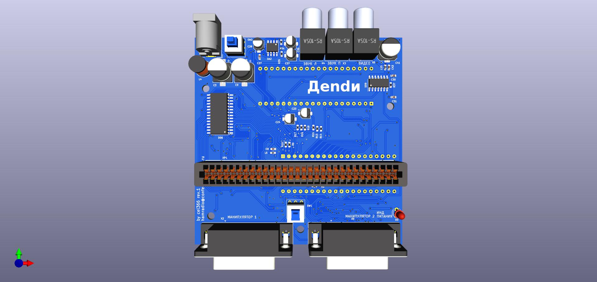
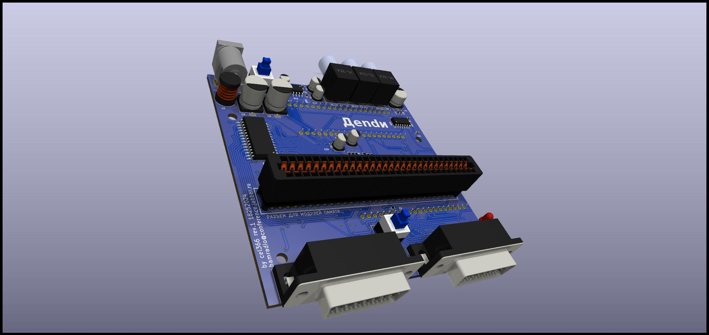
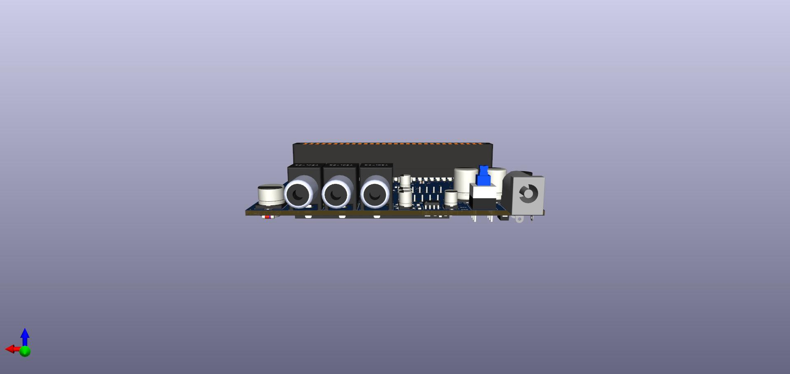
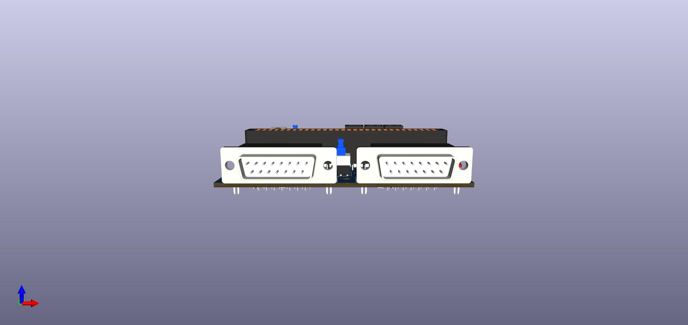
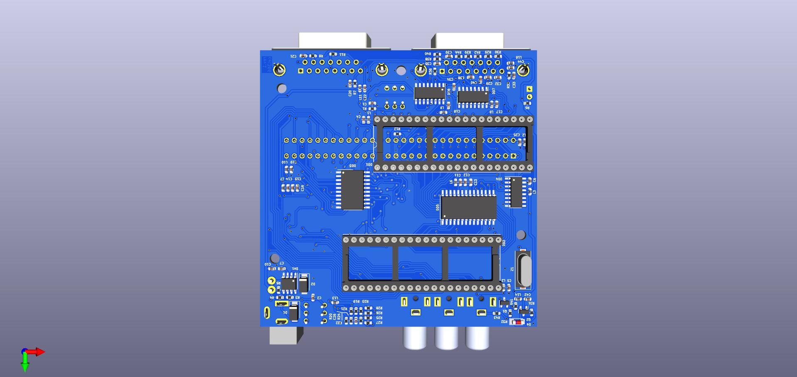

# dendy_clone_smd
Конструкция 8-ми битной приставки ,клона famicom. Максимально элементы применены для поверхностного монтажа . Печатная плата разработана для изготовления в домашних условиях ,поэтому для соединения дорожек на разных слоях использованы переходные отверстия ,для соединениями перемычками .  в папке FAB/lut два файла svg  с слоями верхним(уже от зеркаленным) и нижним  

Плата размером 90х90 ,чтобы можно было потом распечатать на принтере EasyThreeD K9 , у которого печатающая поверхность  100х100,корпус.

